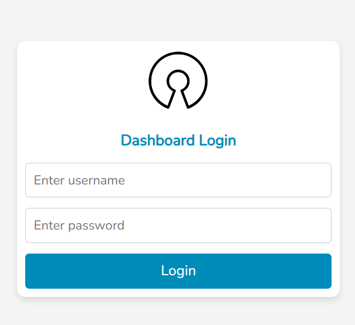
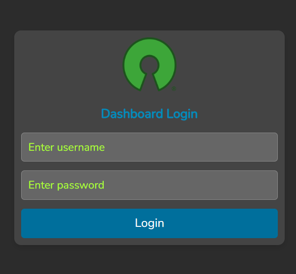
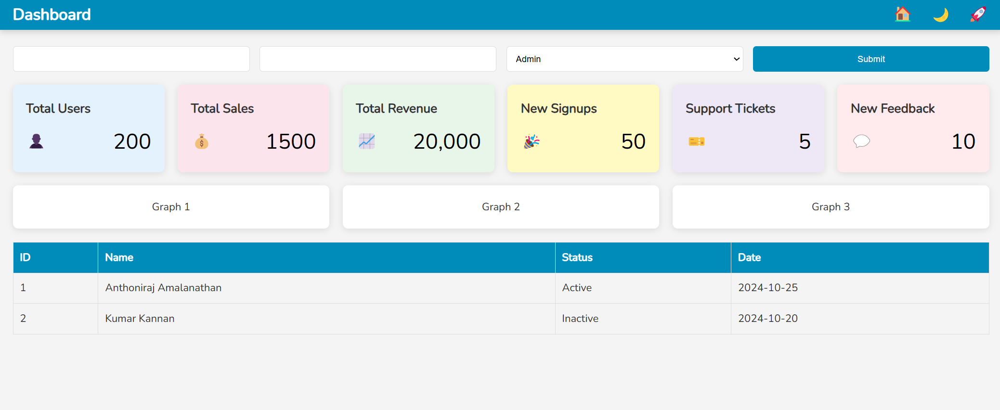
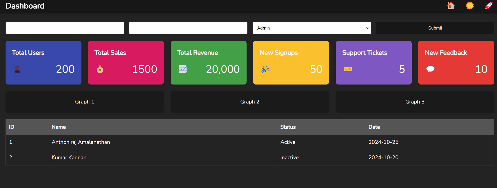

# Responsive Dashboard Template

This repository contains a simple login page and dashboard interface built with HTML and CSS. The design includes a theme switcher, form inputs, and a statistics display using emojis to provide a visually appealing user experience.

## Features

- **Login Page**: Users can enter their username and password to log in.
- **Dashboard**: Displays a header with navigation options, a form for input, statistics in emoji format, graphs, and a table to show user data.
- **Theme Switcher**: A feature to toggle between light and dark themes using a simple script.

## Screenshots
- Login Screen in Light Mode 


- Login Screen in Dark Mode 



- Light Mode with Wide Layout


- Dark Mode with Wide Layout


- Light Mode with Mobile Layout


## Directory Structure

```
/responsive_dashboard_template
├── css
│   ├── dashboard_style.css
│   └── login_style.css
├── images
│   └── logo_for_dark.png
|   └── logo_for_light.png
├── js
│   └── switch-mode.js
├── login.html
└── dashboard.html
```

## Installation

1. Clone the repository:
   ```bash
   git clone https://github.com/anthoniraj/responsive_dashboard_template.git
   ```

2. Navigate to the project directory:
   ```bash
   cd responsive_dashboard_template
   ```

3. Open the `index.html` (or `login.html`) file in your web browser to view the login page.

4. Navigate to the `dashboard.html` file to access the dashboard interface.

## Customization

- **Theme Switcher**: Modify the `switch-mode.js` file to change the theme colors as per your requirements.
- **Styling**: Update the CSS files in the `css` directory to customize the appearance of the login page and dashboard.

## Contributing

If you want to contribute to this project, feel free to fork the repository and submit a pull request.
